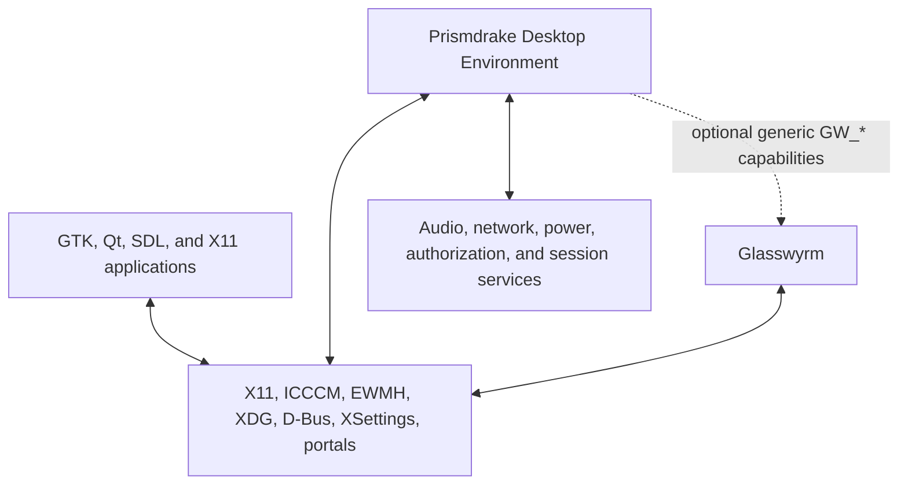

# Prismdrake Desktop Environment
## Project-Wide Product and Technical Specification

| Field | Value |
|---|---|
| Document ID | `PD-SPEC` |
| Version | `0.2.0` |
| Status | Project-wide baseline specification |
| Date | 2026-07-16 |
| Canonical repository | `https://github.com/JTM-rootstorm/prismdrake-de` |
| Repository baseline inspected | `main` at `73075e8be78233ea24ebdbd70c9b7fee42df890e` |
| Repository license | GNU General Public License, Version 3 |
| Intended readers | Maintainers, Codex, contributors, reviewers, designers, testers, and packagers |
| Scope | The entire Prismdrake project, from foundation through 1.0 and subsequent maintenance |

---

## 1. Purpose

This document defines the product, architecture, engineering constraints, compatibility strategy, visual system, functional scope, quality expectations, and lifecycle of the **Prismdrake Desktop Environment**.

It is intentionally project-wide. Milestone plans such as PD0 or PD1 refine this specification for a bounded phase, but they do not replace it. A contributor or coding agent should be able to understand Prismdrake without relying on prior chat history.

Prismdrake is expected to evolve. Decisions that are not yet approved are visibly marked **Proposed** or **Deferred**. Accepted repository decisions may refine this document, but a conflicting change must update the specification rather than creating two competing sources of truth.

---

## 2. Normative language and decision states

The key words **MUST**, **MUST NOT**, **REQUIRED**, **SHOULD**, **SHOULD NOT**, and **MAY** are normative.

- **MUST** and **MUST NOT** define mandatory requirements.
- **SHOULD** and **SHOULD NOT** define strong defaults. Departures require a documented reason.
- **MAY** defines permitted optional behavior.
- **Accepted** identifies a maintainer-approved and authoritative decision.
- **Proposed** identifies a leading design that requires approval through review or an Architecture Decision Record.
- **Deferred** identifies work intentionally postponed.
- **Experimental** identifies an implementation that may change without compatibility guarantees.
- **Deprecated** identifies behavior retained temporarily but scheduled for removal.

Normative requirements use stable identifiers beginning with `PD-`. Issues, pull requests, Architecture Decision Records, tests, and release notes SHOULD cite relevant identifiers.

---

## 3. Authority and conflict resolution

### 3.1 Canonical source

`JTM-rootstorm/prismdrake-de` is the canonical source of truth for Prismdrake.

Chat attachments, copied plans, downstream forks, generated archives, and local notes are not authoritative after newer Accepted material is committed to the canonical repository.

### 3.2 Precedence

When instructions conflict, use this order:

1. Explicit maintainer instructions for the current task.
2. The latest committed version of this specification.
3. Newer Accepted Architecture Decision Records that also update or explicitly supersede affected specification text.
4. Other Accepted repository contracts, schemas, and interfaces.
5. The current milestone plan and issue acceptance criteria.
6. Proposed ADRs and research documents.
7. Mockups, informal discussion, and older attachments.

A contributor MUST NOT silently choose one side of a material conflict. Preserve the higher-precedence source, implement only non-conflicting work, and report the inconsistency.

### 3.3 Specification changes

A change that alters product identity, component ownership, compatibility guarantees, security boundaries, public interfaces, profile behavior, or release scope MUST update this specification or include a follow-up change in the same pull request.

---

## 4. Canonical identity

The following decisions are owner-locked and Accepted.

| ID | Canonical value |
|---|---|
| `PD-ID-001` | Product name: **Prismdrake Desktop Environment** |
| `PD-ID-002` | Short product name: **Prismdrake** |
| `PD-ID-003` | Translucent visual profile: **Prismdrake Lustre** |
| `PD-ID-004` | Classic visual profile: **Prismdrake Forge** |
| `PD-ID-005` | Machine profile identifiers: `lustre` and `forge` |
| `PD-ID-006` | Executable and package prefix: `prismdrake-*` |
| `PD-ID-007` | D-Bus namespace: `org.prismdrake.*` |
| `PD-ID-008` | Glasswyrm-native interface family: generic `GW_*` |
| `PD-ID-009` | Canonical repository: `JTM-rootstorm/prismdrake-de` |
| `PD-ID-010` | Repository license: GPL-3.0, preserving the committed license |

### 4.1 Naming rules

- User-facing names MUST use the capitalization above.
- Machine-readable profile identifiers MUST be lowercase ASCII.
- Prismdrake executables and binary packages MUST use the `prismdrake-` prefix unless an Accepted ADR defines a narrow exception.
- Public Prismdrake D-Bus bus and interface names MUST begin with `org.prismdrake.`.
- Native Glasswyrm protocols MUST NOT include `Prismdrake` in their protocol names.
- Prismdrake MUST NOT use “Aero,” “Luna,” “Windows,” or another Microsoft product name as the name of a component, bundled theme, profile, or feature.
- Abbreviations such as `PDE` SHOULD NOT appear in user-facing text unless later adopted explicitly.

---

## 5. Product definition

### 5.1 Product statement

Prismdrake is a traditional desktop environment for Linux, initially focused on X11. It is designed to provide a polished, expressive, accessible desktop shell that works especially well with Glasswyrm while retaining a standards-based baseline on other conforming X11 window managers and compositors.

Prismdrake provides the desktop shell, session coordination, appearance controls, notifications, toolkit integration, and related desktop services. It is not the X server, display server, window manager, compositor, login manager, kernel, distribution, or full application suite.

### 5.2 Experience goals

| ID | Requirement |
|---|---|
| `PD-PROD-001` | Prismdrake MUST use a familiar desktop metaphor centered on a panel, application launcher, running-application affordances, desktop surface, notifications, and settings. |
| `PD-PROD-002` | The default experience MUST emphasize visual depth, clarity, responsiveness, and direct manipulation. |
| `PD-PROD-003` | Users MUST be able to switch between Prismdrake Lustre and Prismdrake Forge without maintaining separate shell codebases. |
| `PD-PROD-004` | Both profiles MUST be original Prismdrake designs rather than replicas of Microsoft interfaces. |
| `PD-PROD-005` | Familiarity MUST come from workflow, hierarchy, and interaction qualities rather than copied assets or exact geometry. |
| `PD-PROD-006` | Prismdrake MUST remain usable when blur, translucency, animation, or compositing is unavailable or disabled. |
| `PD-PROD-007` | GTK, Qt, and traditional X11 applications SHOULD receive coherent platform settings and optional styling without false claims of pixel identity. |
| `PD-PROD-008` | The desktop SHOULD feel lightweight in operation even when the visual presentation is rich. |
| `PD-PROD-009` | The architecture MUST favor debuggability, fault isolation, and clear ownership over ornamental complexity. |
| `PD-PROD-010` | Accessibility MUST be treated as a product requirement rather than a final polish phase. |

### 5.3 Target users

Prismdrake is intended for people who:

- Prefer a traditional desktop workflow.
- Value polished translucency and layered materials without sacrificing readability.
- Also value a more tactile, compact, colorful classic mode.
- Use a mixture of GTK, Qt, SDL, and traditional X11 applications.
- Want a cohesive Linux desktop without requiring the GNOME desktop stack.
- Want sensible defaults with deep but understandable customization.
- May run Prismdrake with Glasswyrm or another standards-capable X11 environment.

### 5.4 Product personality

Prismdrake SHOULD feel precise, luminous, tactile, and quietly playful. Its identity should use original prismatic and draconic motifs sparingly. The desktop must not become a fantasy-themed novelty interface or allow decoration to obscure information.

---

## 6. Scope and non-goals

### 6.1 Core project scope

The core project includes:

- Session startup, environment, supervision, logout, and recovery.
- A desktop shell with panel, launcher, task presentation, desktop surface, quick settings, status area, on-screen displays, and notification surfaces.
- Desktop appearance configuration and profile switching.
- A notification service and history model.
- Optional server-side decoration presentation coordinated with the window manager.
- Settings propagation through suitable X11, D-Bus, XDG, XSettings, and portal mechanisms.
- Optional GTK and Qt integration packages.
- Glasswyrm capability integration through generic, versioned interfaces.
- Accessibility, internationalization, testing, diagnostics, packaging, and release infrastructure.

### 6.2 Core 1.0 non-goals

| ID | Requirement |
|---|---|
| `PD-SCOPE-001` | Prismdrake MUST NOT implement X11 server, window-manager, or compositor policy. |
| `PD-SCOPE-002` | Prismdrake MUST NOT require a bundled file manager, terminal, browser, editor, office suite, or application store for core 1.0. |
| `PD-SCOPE-003` | Companion applications MAY be created later, but each requires separate scope, ownership, and lifecycle decisions. |
| `PD-SCOPE-004` | Prismdrake MUST NOT copy proprietary icons, fonts, sounds, wallpapers, logos, layouts, or source code. |
| `PD-SCOPE-005` | Prismdrake MUST NOT claim complete visual control over applications that intentionally own their presentation. |
| `PD-SCOPE-006` | Wayland support is Deferred for the initial product. Architecture SHOULD avoid needless barriers to a future port. |
| `PD-SCOPE-007` | A third-party in-process plugin ABI is Deferred for 1.0 unless a security and compatibility model is accepted. |
| `PD-SCOPE-008` | Prismdrake MUST NOT require systemd as the only possible session-supervision mechanism. |
| `PD-SCOPE-009` | Prismdrake MUST NOT treat a decorative lock overlay as a secure session lock. |
| `PD-SCOPE-010` | Prismdrake MUST NOT embed privileged network, power, package, or authentication logic in the shell process. |

---

## 7. Platform and compatibility tiers

### 7.1 Initial platform

- Operating system family: Linux.
- Initial window-system target: X11.
- Primary enhanced environment: Glasswyrm.
- Development environments MAY include Xorg, Xvfb, Xephyr, and other standards-capable X11 stacks.
- Supported CPU architectures and minimum library versions MUST be established by packaging and release policy before beta.

### 7.2 Compatibility tiers

| Tier | Environment | Expected experience |
|---|---|---|
| Tier A | Glasswyrm with accepted native `GW_*` capabilities | Full supported experience, including negotiated effects and richer integration |
| Tier B | Standards-capable X11 window manager and compositor | Functional desktop using ICCCM, EWMH, XDG, D-Bus, XSettings, and freedesktop contracts |
| Tier C | X11 without supported compositing effects | Functional opaque or reduced-transparency desktop with effects disabled |
| Deferred | Wayland compositor | No initial support commitment |

| ID | Requirement |
|---|---|
| `PD-PLAT-001` | Prismdrake MUST detect capabilities rather than infer them from process or binary names. |
| `PD-PLAT-002` | Every Tier A enhancement MUST define a Tier B or Tier C fallback. |
| `PD-PLAT-003` | Missing optional capabilities MUST NOT prevent session startup. |
| `PD-PLAT-004` | Unsupported combinations MUST produce useful diagnostics rather than undefined behavior. |
| `PD-PLAT-005` | Release documentation MUST state tested environments and known limitations honestly. |

---

## 8. Architecture principles

### 8.1 Standards first, native enhancements second

Prismdrake MUST implement basic desktop behavior through established X11 and freedesktop mechanisms where suitable. Glasswyrm-specific features enhance the experience but do not replace standards without an explicit, justified requirement.

### 8.2 Clear authority

Each state domain must have one authoritative owner. Mirrored state is a cache or presentation model, never a second source of truth.

### 8.3 UI and policy separation

Declarative UI code MAY define layout, presentation, and animation. Persistent state, parsing, policy, system integration, and security decisions SHOULD remain in testable non-visual code or isolated services.

### 8.4 Immutable validated snapshots

Configuration and theme data SHOULD be resolved into immutable, validated, generation-tagged snapshots. Components must not observe a half-applied profile or partial settings update.

### 8.5 Graceful degradation

Every visual effect, native capability, and optional service MUST define a safe fallback.

### 8.6 Fault isolation

A shell crash MUST NOT destroy window-manager state. A settings service crash MUST NOT corrupt persisted configuration. A notification service crash MUST NOT make the desktop unstartable.

### 8.7 Dependency isolation

Toolkit-specific, privileged, and integration-specific code SHOULD be isolated so optional functionality does not expand the mandatory runtime graph.

### 8.8 Originality by construction

Visual tokens, component geometry, icons, motion, sounds, and assets MUST be created as Prismdrake work or sourced under clear compatible licenses.

---

## 9. System context and ownership



### 9.1 Glasswyrm ownership

Glasswyrm owns:

- X11 server behavior.
- Window-management policy.
- Authoritative window state.
- Focus and stacking.
- Move, resize, minimize, maximize, fullscreen, and workspace policy.
- Composition and output composition.
- Backdrop blur execution.
- Compositor shadows and scene effects.
- Scene capture and window-thumbnail production.
- Input and output policy.
- Accepted native `GW_*` capabilities.

Prismdrake MUST NOT duplicate or override these responsibilities.

### 9.2 Prismdrake ownership

Prismdrake owns:

- Desktop session startup and environment.
- Panel, launcher, desktop surface, task presentation, quick settings, status presentation, and on-screen displays.
- Desktop appearance, profile selection, and user-facing settings.
- Notification service, presentation, and history policy.
- Toolkit settings propagation and optional style adapters.
- Desktop-specific portal integration.
- Effect requests, capability negotiation, fallback choice, and user-visible diagnostics.

### 9.3 External service ownership

Prismdrake consumes external system services for audio, networking, power, authorization, device management, and login/session operations. It MUST NOT become the authoritative implementation of those domains merely to show controls for them.

---

## 10. Component model

The names below are the Accepted project-wide component model under
[ADR 0002](adr/0002-component-and-process-model.md). The
`prismdrake-*` prefix remains independently owner-locked by the identity
decision.

| Component | Responsibility | Key boundaries |
|---|---|---|
| `prismdrake-session` | Session environment, startup, supervision, safe mode, logout, and restart coordination | No shell rendering; no WM policy |
| `prismdrake-shell` | Panel, launcher, desktop, task UI, quick settings, status area, notification surfaces, and OSDs | Presentation and interaction, not authoritative window state |
| `prismdrake-settingsd` | Validated settings, profile switching, XSettings, settings snapshots, and change broadcasts | No user-facing control center UI |
| `prismdrake-notifyd` | Freedesktop notification service, policy, history, and routing | UI surfaces rendered by shell or a narrow presentation client |
| `prismdrake-decor` | Optional server-side decoration rendering from authoritative WM state | No focus, stacking, or window-state policy |
| `prismdrake-control` | User-facing control center | Uses public or internal service interfaces, does not edit hidden state directly |
| `prismdrake-portal` | Desktop-specific portal backend integration | Optional and separately packaged where practical |
| `prismdrake-polkit-agent` | Authorization prompts | Separate process and minimal responsibility |
| `prismdrake-lock` | Secure lock presentation and protocol coordination | Deferred until a credible X11 and Glasswyrm security model is accepted |
| `prismdrake-themes` | Shared tokens, icons, cursors, wallpapers, and profile assets | Data only; no executable theme scripts |
| `prismdrake-style-qt` | Optional Qt integration and style adapters | Must not be required by non-Qt services |
| `prismdrake-theme-gtk` | Optional GTK integration assets and settings | Must not require GNOME desktop components |

### 10.1 Shell logical modules

`prismdrake-shell` SHOULD begin as one process with well-separated logical modules rather than one process per widget:

- Panel and task strip.
- Launcher and search presentation.
- Desktop surface.
- Window and workspace presentation models.
- Quick settings and status area.
- Notification surfaces and history view.
- On-screen displays.
- Shared animation, accessibility, and theme services.

A later process split requires an ADR that demonstrates a fault-isolation, security, performance, or dependency benefit.

### 10.2 Component requirements

| ID | Requirement |
|---|---|
| `PD-COMP-001` | Every component MUST document owned state, inputs, outputs, failure behavior, and forbidden responsibilities. |
| `PD-COMP-002` | Core non-visual services SHOULD avoid a GUI toolkit dependency where practical. |
| `PD-COMP-003` | A shell restart MUST leave authoritative window state intact. |
| `PD-COMP-004` | A decorator failure MUST leave a usable fallback for move, resize, close, and focus operations. |
| `PD-COMP-005` | Toolkit adapters MUST be separately installable where practical. |
| `PD-COMP-006` | Core startup MUST NOT require both GTK and Qt runtime stacks. |
| `PD-COMP-007` | Privileged prompts MUST NOT execute inside the general shell process. |
| `PD-COMP-008` | Process boundaries MUST avoid cyclic startup dependencies. |
| `PD-COMP-009` | Interprocess interfaces MUST be versioned before being treated as stable. |
| `PD-COMP-010` | Component crashes MUST generate actionable diagnostics without exposing secrets. |

---

## 11. Session and process lifecycle

### 11.1 Startup sequence

The intended startup flow is:

1. Establish the Prismdrake session environment and XDG variables.
2. Validate packaged defaults and user configuration.
3. Start or connect to required session D-Bus infrastructure.
4. Start `prismdrake-settingsd` and publish the initial settings generation.
5. Detect window-system and compositor capabilities.
6. Start non-visual services such as `prismdrake-notifyd`.
7. Start `prismdrake-shell` using the validated settings and theme snapshots.
8. Start optional adapters and portal services.
9. Report degraded or missing optional capabilities to diagnostics.
10. Mark the session ready.

### 11.2 Supervision

- `prismdrake-session` SHOULD supervise restartable Prismdrake components.
- Restart loops MUST use bounded retry and backoff.
- Repeated failure SHOULD enter a safe mode with packaged defaults, opaque materials, reduced animation, and optional integrations disabled.
- Supervision MUST NOT require systemd exclusively. A systemd user-unit integration MAY be provided.
- The user MUST be able to terminate a crash loop without losing access to a basic session exit path.

### 11.3 Shutdown

Shutdown and logout MUST:

- Stop accepting new shell work.
- Flush safe persistent state.
- Request applications to close through established session mechanisms where available.
- Release D-Bus names and X11 selections cleanly.
- Avoid blocking indefinitely on an unresponsive optional service.
- Delegate reboot, shutdown, suspend, and hibernate authorization to appropriate system services.

### 11.4 Session requirements

| ID | Requirement |
|---|---|
| `PD-SESSION-001` | Startup MUST use validated defaults when user configuration is absent or invalid. |
| `PD-SESSION-002` | Partial startup failure MUST result in a degraded session or clear terminal diagnostics, not silent hanging. |
| `PD-SESSION-003` | Component restart MUST preserve the last valid settings and theme generations. |
| `PD-SESSION-004` | Logout and power actions MUST use typed service interfaces rather than shell commands assembled from user-visible text. |
| `PD-SESSION-005` | Session environment changes that require restart MUST be surfaced clearly. |
| `PD-SESSION-006` | Safe mode MUST be documented and testable before beta. |

---

## 12. Technology and dependency policy

### 12.1 Accepted PD1 implementation architecture

The following direction is Accepted for PD1 through ADRs 0003, 0004, 0006, and
0008. It does not make every dependency mandatory for every component or
stabilize public implementation interfaces:

- Visible shell surfaces: Qt 6.11 Quick or newer.
- Shell models and integration: modern C++.
- Non-visual core services: modern C++ with D-Bus and X11/XCB interfaces as appropriate.
- Build system: CMake.
- User configuration: versioned TOML.
- Theme contracts: versioned JSON with schemas.
- Capability contracts: versioned JSON documents that remain subject to the
  separately Proposed native-integration decisions.
- D-Bus interfaces: versioned XML definitions under `org.prismdrake.*`; current
  interface shapes remain explicitly draft until separately stabilized.

Production implementation MUST preserve the dependency isolation and interface
stability limits recorded by the Accepted ADRs.

### 12.2 Toolkit expectations

For the Accepted Qt 6.11-or-newer Quick visible-shell direction:

- Qt 6.11 is the minimum supported toolkit version for Qt-bound Prismdrake
  components; Qt 6.4 compatibility is not a project target.
- QML SHOULD contain layout, visual state, and animation.
- Persistent policy, parsing, D-Bus access, window models, and settings logic SHOULD remain in C++ or service interfaces.
- QML MUST NOT become the sole source of security or authorization decisions.
- The shell SHOULD provide deterministic rendering paths for visual tests.
- Qt Widgets MAY be used for narrowly justified utilities, but mixed UI technologies require consistency review.

### 12.3 Dependency boundaries

Mandatory core runtime dependencies MUST NOT include:

- GNOME Shell.
- Mutter.
- `gnome-settings-daemon`.
- `gnome-control-center`.
- libadwaita.

GTK itself is not categorically forbidden. A GTK integration package may depend on GTK or GLib where justified. Qt is not automatically a dependency of non-visual services.

### 12.4 Dependency requirements

| ID | Requirement |
|---|---|
| `PD-DEP-001` | Every new mandatory runtime dependency MUST be justified by an ADR, dependency policy, or reviewed component change. |
| `PD-DEP-002` | Development-only tooling MUST NOT silently become a runtime dependency. |
| `PD-DEP-003` | Optional toolkit adapters MUST NOT prevent core session startup when absent. |
| `PD-DEP-004` | Vendored third-party code SHOULD be avoided unless system packaging is impractical and licensing is documented. |
| `PD-DEP-005` | Dependency detection MUST fail with actionable configuration messages. |
| `PD-DEP-006` | Build features MUST be explicit rather than inferred from accidental host packages. |
| `PD-DEP-007` | The project SHOULD support GCC and Clang on tested Linux platforms. |
| `PD-DEP-008` | Build and packaging policy MUST record minimum supported versions before beta. |

---

## 13. Configuration, state, and schemas

### 13.1 XDG locations

The Accepted default layout is:

- User configuration: `$XDG_CONFIG_HOME/prismdrake/`
- User state: `$XDG_STATE_HOME/prismdrake/`
- User cache: `$XDG_CACHE_HOME/prismdrake/`
- Packaged data: distribution-appropriate XDG data directories
- Runtime state: `$XDG_RUNTIME_DIR/prismdrake/` when needed

A user home directory MUST NOT be hard-coded.

### 13.2 Configuration domains

The project configuration model SHOULD include:

- Schema version.
- Active profile.
- Appearance, accent, transparency, blur preference, and motion.
- Text scale, cursor, icon theme, contrast, and accessibility.
- Panel placement, size, behavior, and per-output options.
- Launcher behavior, search providers, pinned entries, and privacy settings.
- Notification policy, history, timeout, and do-not-disturb.
- Desktop wallpaper, layout, and icon behavior.
- Integration exports for GTK, Qt, XSettings, and portals.
- Keyboard shortcuts and input behavior.
- Developer diagnostics that are disabled by default in production.

### 13.3 Snapshot model

A resolved settings snapshot SHOULD contain:

```text
schema_version
profile_id
generation
logical_source_ids
resolved_values
capability_overrides
validation_warnings
restart_required_domains
```

Profile switching SHOULD follow this transaction:

1. Load candidate configuration and token data.
2. Validate all referenced schemas and assets.
3. Resolve defaults and overrides.
4. Build immutable settings and theme snapshots.
5. Assign a monotonically increasing generation.
6. Publish the generation atomically.
7. Retain the current and immediately previous complete generations in memory.
8. On validation or serialization failure before publication, keep the prior generation
   authoritative and do not consume a generation number.

PD1 does not define a consumer-acknowledgement transaction. Once the complete
typed and transport snapshots are swapped atomically, that generation is
authoritative. A later content rollback, if separately designed, publishes the
prior content as a new monotonically increasing generation rather than reusing
an observed generation number.

### 13.4 Configuration requirements

| ID | Requirement |
|---|---|
| `PD-CONFIG-001` | User-controlled configuration and theme data MUST be treated as untrusted input. |
| `PD-CONFIG-002` | Unsupported schema versions MUST fail safely with actionable diagnostics. |
| `PD-CONFIG-003` | Invalid configuration MUST NOT overwrite the last known valid configuration automatically. |
| `PD-CONFIG-004` | Accessibility preferences MUST survive profile changes unless explicitly changed by the user. |
| `PD-CONFIG-005` | A profile switch MUST NOT publish a mixed Lustre and Forge state. |
| `PD-CONFIG-006` | Migrations MUST be explicit, versioned, testable, and reversible where practical. |
| `PD-CONFIG-007` | Secrets and credentials MUST NOT be stored in ordinary Prismdrake configuration. |
| `PD-CONFIG-008` | D-Bus settings APIs MUST be typed and narrow rather than unrestricted arbitrary-key mutation. |
| `PD-CONFIG-009` | Packaged defaults MUST remain available as a recovery source. |
| `PD-CONFIG-010` | Configuration writes MUST be atomic and preserve file permissions. |

---

## 14. Visual system and profiles

### 14.1 One semantic system

Prismdrake Lustre and Prismdrake Forge MUST share one semantic token model and common component implementation. Profiles override values and selected behaviors rather than forking the shell.

The token hierarchy SHOULD include:

1. Primitive tokens: raw colors, opacity, spacing, typography, radii, durations, and easing identifiers.
2. Semantic tokens: panel surface, elevated surface, text, focus, selection, active border, warning, danger, and muted states.
3. Component tokens: task button, launcher tile, title-bar button, notification card, menu item, tooltip, and quick-setting control.
4. Accessibility and capability fallbacks: high contrast, reduced motion, disabled transparency, missing blur, and low-power mode.

### 14.2 Prismdrake Lustre

Lustre is the primary translucent profile. It SHOULD use:

- Layered translucent surfaces.
- Compositor-provided backdrop blur when available.
- Prismatic edge highlights and restrained facet effects.
- Clear contrast over changing backgrounds.
- Moderate rounding.
- Directional, restrained shadows.
- Smooth, brief motion that communicates continuity.
- An original material language rather than copied Aero geometry.
- Purpose-designed opaque and reduced-transparency fallbacks.

### 14.3 Prismdrake Forge

Forge is the classic tactile profile. It SHOULD use:

- Mostly opaque surfaces.
- Stronger borders and surface separation.
- Tactile gradients or dimensional cues.
- Sharper or tighter geometry.
- Saturated but user-adjustable accents.
- Crisp state transitions and shorter motion.
- Larger and more obvious active, pressed, and urgent task states.
- Original geometry rather than copied Luna assets or layouts.

### 14.4 Theme requirements

| ID | Requirement |
|---|---|
| `PD-THEME-001` | Both profiles MUST implement the same required semantic token set. |
| `PD-THEME-002` | Every blur-capable material MUST define a non-blur fallback. |
| `PD-THEME-003` | High-contrast, reduced-motion, and disabled-transparency behavior MUST exist for both profiles. |
| `PD-THEME-004` | Theme assets MUST be original or carry compatible provenance and licensing. |
| `PD-THEME-005` | Theme packages MUST NOT execute arbitrary scripts. |
| `PD-THEME-006` | Theme loading MUST reject path traversal, malformed data, and unsupported versions. |
| `PD-THEME-007` | Profile switching SHOULD occur without logging out. |
| `PD-THEME-008` | Focus and urgency MUST remain visible in every profile and accessibility variant. |
| `PD-THEME-009` | Status MUST NOT rely on hue alone. |
| `PD-THEME-010` | Visual testing MUST cover both profiles and fallback states. |

---

## 15. Functional desktop specification

### 15.1 Panel and task strip

The panel is the primary persistent navigation surface.

| ID | Requirement |
|---|---|
| `PD-PANEL-001` | The default panel placement SHOULD be the bottom edge, with supported configuration for other edges when layout quality is complete. |
| `PD-PANEL-002` | The panel MUST present pinned applications, running applications, active state, urgency, and window grouping. |
| `PD-PANEL-003` | Task entries MUST expose keyboard focus, pointer states, context actions, and accessible labels. |
| `PD-PANEL-004` | The panel SHOULD support per-output instances or a documented primary-output policy. |
| `PD-PANEL-005` | Work-area reservation MUST use appropriate X11 standards in the baseline path. |
| `PD-PANEL-006` | Status items SHOULD prefer StatusNotifierItem; any XEmbed bridge MUST be optional and isolated. |
| `PD-PANEL-007` | Autohide, if implemented, MUST remain keyboard accessible and avoid trapping pointer input. |
| `PD-PANEL-008` | Missing optional status services MUST not leave broken empty controls. |

### 15.2 Application launcher and search

| ID | Requirement |
|---|---|
| `PD-LAUNCH-001` | The launcher MUST discover applications through standard desktop-entry mechanisms. |
| `PD-LAUNCH-002` | Search MUST support application names, generic names, keywords, categories, and settings destinations. |
| `PD-LAUNCH-003` | Desktop-entry execution MUST follow the desktop-entry contract and MUST NOT pass composed commands through an implicit shell. |
| `PD-LAUNCH-004` | Search providers that expose files, history, or online data MUST be optional and disclose privacy behavior. |
| `PD-LAUNCH-005` | The launcher MUST be fully operable by keyboard. |
| `PD-LAUNCH-006` | Recent-item storage MUST be user-controllable and clearable. |
| `PD-LAUNCH-007` | Search results MUST remain deterministic under identical local inputs. |
| `PD-LAUNCH-008` | The launcher SHOULD provide clear empty, loading, error, and no-result states. |

### 15.3 Desktop surface

| ID | Requirement |
|---|---|
| `PD-DESKTOP-001` | The desktop surface MUST support wallpaper presentation across one or more outputs. |
| `PD-DESKTOP-002` | Wallpaper scaling modes MUST be explicit and predictable. |
| `PD-DESKTOP-003` | Desktop icons MAY be enabled, disabled, or delegated, but ownership must be unambiguous. |
| `PD-DESKTOP-004` | File operations, if desktop icons are supported, MUST use established file APIs and safe conflict handling. |
| `PD-DESKTOP-005` | The desktop surface MUST not capture input intended for application or WM operations. |
| `PD-DESKTOP-006` | Wallpaper and icon state MUST survive output hotplug without corrupting layout data. |

### 15.4 Window and task presentation

| ID | Requirement |
|---|---|
| `PD-WIN-001` | Glasswyrm or the active window manager remains authoritative for window state. |
| `PD-WIN-002` | The baseline task model SHOULD consume ICCCM and EWMH metadata where suitable. |
| `PD-WIN-003` | Windows marked to skip task presentation MUST be handled correctly. |
| `PD-WIN-004` | Native window thumbnails MUST be capability-negotiated and have icon-and-title fallbacks. |
| `PD-WIN-005` | Closing, minimizing, activating, and moving windows MUST be requested through the authoritative WM path. |
| `PD-WIN-006` | Stale or destroyed windows MUST be removed without dereferencing invalid state. |
| `PD-WIN-007` | Application identity heuristics MUST be documented and testable. |

### 15.5 Workspaces and overview

| ID | Requirement |
|---|---|
| `PD-WS-001` | Workspace presentation MUST mirror authoritative WM state. |
| `PD-WS-002` | Basic workspace behavior SHOULD use standard X11 desktop conventions where available. |
| `PD-WS-003` | Rich metadata and animated overviews MAY use negotiated Glasswyrm capabilities. |
| `PD-WS-004` | Workspace switching MUST remain keyboard accessible. |
| `PD-WS-005` | Missing thumbnail support MUST not remove basic workspace navigation. |

### 15.6 Quick settings and status

| ID | Requirement |
|---|---|
| `PD-QUICK-001` | Quick settings MUST act through typed system or adapter interfaces. |
| `PD-QUICK-002` | Audio, network, Bluetooth, power, brightness, and device controls MUST remain optional based on available services and hardware. |
| `PD-QUICK-003` | Privileged actions MUST request authorization through an appropriate agent. |
| `PD-QUICK-004` | Controls MUST distinguish unavailable, disabled, disconnected, and error states. |
| `PD-QUICK-005` | The shell MUST NOT contain its own authoritative network or power-management implementation. |
| `PD-QUICK-006` | On-screen displays SHOULD use the same semantic tokens and accessibility settings as the shell. |

### 15.7 Notifications

| ID | Requirement |
|---|---|
| `PD-NOTIFY-001` | Prismdrake notifications MUST implement the applicable freedesktop notification service contract. |
| `PD-NOTIFY-002` | Actions, replacement identifiers, urgency, timeout, and application metadata MUST be handled predictably. |
| `PD-NOTIFY-003` | Notification history MUST have explicit retention, privacy, and clearing controls. |
| `PD-NOTIFY-004` | Do-not-disturb MUST not silently discard critical system information without a documented policy. |
| `PD-NOTIFY-005` | Notification surfaces MUST be keyboard and screen-reader accessible. |
| `PD-NOTIFY-006` | Notification content MUST be treated as untrusted text and image data. |
| `PD-NOTIFY-007` | A shell restart SHOULD preserve notification service continuity when `prismdrake-notifyd` remains healthy. |

### 15.8 Window decorations

| ID | Requirement |
|---|---|
| `PD-DECOR-001` | Decoration rendering MUST consume authoritative window state rather than invent policy. |
| `PD-DECOR-002` | Close, maximize, minimize, move, and resize actions MUST be requested from the WM. |
| `PD-DECOR-003` | Hit targets MUST satisfy accessibility sizing and input-modality requirements. |
| `PD-DECOR-004` | Client-side-decorated applications MUST remain supported even when their appearance differs. |
| `PD-DECOR-005` | A decoration crash MUST fall back to usable WM controls or borders. |
| `PD-DECOR-006` | Active, inactive, urgent, maximized, fullscreen, and tiled states MUST be visually distinguishable. |

### 15.9 Control center

| ID | Requirement |
|---|---|
| `PD-CONTROL-001` | The control center MUST use service APIs or validated configuration interfaces rather than bypassing component ownership. |
| `PD-CONTROL-002` | Settings pages MUST expose validation errors without discarding unrelated valid changes. |
| `PD-CONTROL-003` | Settings that require component or session restart MUST say so before application. |
| `PD-CONTROL-004` | Search SHOULD locate settings by name, synonym, and category. |
| `PD-CONTROL-005` | Every setting MUST have a defined default and ownership domain. |
| `PD-CONTROL-006` | Dangerous or destructive settings MUST require clear confirmation and recovery guidance. |

### 15.10 Session, power, and locking

| ID | Requirement |
|---|---|
| `PD-POWER-001` | Logout, reboot, shutdown, suspend, and hibernate requests MUST be delegated to appropriate system services. |
| `PD-POWER-002` | Availability and authorization state MUST be reflected accurately. |
| `PD-POWER-003` | Unsaved-work warnings SHOULD use established session mechanisms rather than pretending to know every application state. |
| `PD-LOCK-001` | Prismdrake MUST NOT claim secure locking until input, display, privilege, and escape-path behavior is threat-modeled and tested. |
| `PD-LOCK-002` | Lock authentication MUST be isolated from the general shell process. |
| `PD-LOCK-003` | Sensitive notification content MUST be suppressible on a lock surface. |

### 15.11 Input and shortcuts

| ID | Requirement |
|---|---|
| `PD-INPUT-001` | Primary shell actions MUST be available by keyboard. |
| `PD-INPUT-002` | Global shortcuts MUST be coordinated with the authoritative WM or negotiated Glasswyrm interface. |
| `PD-INPUT-003` | Shortcut conflicts MUST be detectable and explained to the user. |
| `PD-INPUT-004` | Pointer, keyboard, touchpad, and touch behavior MUST not rely on hover alone. |
| `PD-INPUT-005` | Input settings owned by external services MUST be presented through adapters rather than duplicated policy. |

### 15.12 Multiple outputs and scaling

| ID | Requirement |
|---|---|
| `PD-OUTPUT-001` | The shell MUST handle output add, remove, resize, rotate, scale, and primary-output changes without restart where the platform permits. |
| `PD-OUTPUT-002` | Panel, launcher, notifications, and OSD placement MUST have an explicit per-output policy. |
| `PD-OUTPUT-003` | Mixed-scale layouts MUST avoid blurry text and inconsistent input geometry. |
| `PD-OUTPUT-004` | Windows and shell surfaces MUST remain recoverable when an output disappears. |
| `PD-OUTPUT-005` | Display configuration changes MUST be confirmed or automatically reverted when they can make the session unusable. |

---

## 16. Accessibility

Accessibility requirements apply to every milestone that creates user-facing behavior.

| ID | Requirement |
|---|---|
| `PD-A11Y-001` | All primary shell functions MUST be keyboard operable. |
| `PD-A11Y-002` | Focus order MUST be deterministic and visible. |
| `PD-A11Y-003` | Interactive controls MUST expose accessible names, roles, states, and descriptions through the chosen toolkit and platform bridge. |
| `PD-A11Y-004` | Both profiles MUST define high-contrast, reduced-motion, and disabled-transparency behavior. |
| `PD-A11Y-005` | Text scale MUST be independent of profile selection. |
| `PD-A11Y-006` | Minimum target size MUST be represented in design tokens and tested. |
| `PD-A11Y-007` | Color MUST NOT be the only indicator of state, urgency, success, or failure. |
| `PD-A11Y-008` | Motion that communicates continuity MUST have a reduced-motion alternative. |
| `PD-A11Y-009` | Animations MUST NOT block input or delay essential actions. |
| `PD-A11Y-010` | Contrast MUST be evaluated against real wallpaper and blur fallback conditions. |
| `PD-A11Y-011` | Screen-reader and assistive-technology smoke tests MUST be part of beta readiness. |
| `PD-A11Y-012` | Accessibility regressions MUST be treated as functional regressions. |

---

## 17. GTK, Qt, X11, and freedesktop integration

### 17.1 Compatibility definition

Compatibility means correct protocol behavior, platform settings, application discovery, icons, cursors, fonts, scaling, notifications, portals, and optional styling. It does not mean forcing every application to look identical.

### 17.2 Baseline standards

The project SHOULD use suitable established contracts, including:

- XDG base directories.
- Desktop Entry Specification.
- Icon Theme Specification.
- ICCCM and EWMH.
- D-Bus.
- XSettings.
- Freedesktop notifications.
- StatusNotifierItem where available.
- Portals for sandboxed applications.
- Standard autostart and MIME/default-application mechanisms.

### 17.3 GTK integration

Prismdrake GTK integration SHOULD provide:

- Fonts and DPI.
- Icon and cursor themes.
- XSettings values.
- Color-scheme preference where supported.
- Optional Prismdrake GTK theme assets.
- Portal settings for sandboxed applications.

Applications that intentionally use their own client-side presentation may remain visually distinct. libadwaita is not a mandatory core dependency.

### 17.4 Qt integration

Prismdrake Qt integration SHOULD provide:

- Fonts and DPI.
- Icon and cursor themes.
- Palette or color-scheme preferences where supported.
- An optional Qt Widgets style plugin.
- An optional Qt Quick Controls style where applications permit external selection.

Not every Qt Quick application can or should be forcibly restyled.

### 17.5 Integration requirements

| ID | Requirement |
|---|---|
| `PD-INT-001` | Toolkit adapters MUST be optional and separable from non-toolkit services. |
| `PD-INT-002` | Missing a GTK or Qt style adapter MUST NOT prevent session startup. |
| `PD-INT-003` | Core operation MUST NOT require both toolkit stacks. |
| `PD-INT-004` | Compatibility limitations MUST be documented honestly. |
| `PD-INT-005` | Legacy XEmbed tray support, if implemented, MUST be optional and isolated. |
| `PD-INT-006` | Portal interfaces MUST be versioned and tested against sandboxed applications. |
| `PD-INT-007` | Desktop-entry and icon lookup behavior MUST follow standard search rules. |
| `PD-INT-008` | Prismdrake MUST NOT overwrite user toolkit configuration destructively. |

---

## 18. Glasswyrm integration

### 18.1 Baseline and enhancement split

The standards baseline may provide:

- Active-window and window-list state.
- Dock work-area reservation.
- Basic workspace information.
- Ordinary alpha surfaces.
- Standard notifications and settings propagation.

Optional Glasswyrm-native capabilities may provide:

- Shell surface roles.
- Backdrop blur regions and parameters.
- Reliable window thumbnails.
- Rich workspace metadata.
- Decoration coordination.
- Compositor diagnostics.
- Animation synchronization.
- Secure session-lock primitives after threat-model review.

### 18.2 Candidate native names

Candidate names may include:

- `GW_SHELL_ROLE_V1`
- `GW_BACKDROP_V1`
- `GW_WINDOW_THUMBNAIL_V1`
- `GW_WORKSPACE_V1`
- `GW_DECORATION_V1`

These are placeholders until accepted by Glasswyrm. They MUST NOT be represented as implemented or stable.

### 18.3 Effect ownership

| ID | Requirement |
|---|---|
| `PD-GW-001` | Prismdrake MUST express effect intent and geometry rather than implement composition. |
| `PD-GW-002` | Backdrop blur MUST be performed by the compositor. |
| `PD-GW-003` | Prismdrake MUST NOT capture and blur desktop screenshots to simulate native backdrop blur. |
| `PD-GW-004` | Every blur request MUST define reduced-transparency and opaque fallbacks. |
| `PD-GW-005` | Native capabilities MUST be negotiated explicitly and versioned. |
| `PD-GW-006` | Native interface names MUST use generic `GW_*` identifiers. |
| `PD-GW-007` | Thumbnail and capture capabilities MUST receive privacy and authorization design before implementation. |
| `PD-GW-008` | Missing or incompatible native support MUST not fail the desktop session. |
| `PD-GW-009` | Glasswyrm remains authoritative for window state and effect execution. |
| `PD-GW-010` | Prismdrake MUST NOT infer native support from a process name alone. |

---

## 19. Security and privacy

### 19.1 Trust boundaries

Treat these as untrusted inputs:

- User configuration.
- Themes, images, icons, and cursors.
- Desktop entries.
- Notification text and images.
- D-Bus messages from other processes.
- Window metadata and icons.
- Portal responses.
- Native capability payloads.
- Files from removable or network-backed storage.

### 19.2 Security requirements

| ID | Requirement |
|---|---|
| `PD-SEC-001` | Parsers MUST reject malformed, oversized, unsupported, or dangerous input without crashing. |
| `PD-SEC-002` | Desktop-entry commands MUST NOT be executed through an implicit shell. |
| `PD-SEC-003` | Privileged operations MUST use an appropriate authorization service and minimal agent process. |
| `PD-SEC-004` | D-Bus methods MUST validate types, ranges, sender assumptions, and state transitions. |
| `PD-SEC-005` | Themes MUST be data-only for 1.0 and MUST NOT load arbitrary executable code. |
| `PD-SEC-006` | Window thumbnails and scene capture MUST respect privacy, authorization, lock state, and scope. |
| `PD-SEC-007` | Notification history MUST expose retention and clearing controls. |
| `PD-SEC-008` | Secrets, tokens, credentials, and private keys MUST NOT appear in examples, logs, crash reports, or ordinary configuration. |
| `PD-SEC-009` | Developer overrides MUST be disabled by default in production builds. |
| `PD-SEC-010` | A secure lock path MUST be independently threat-modeled and tested. |
| `PD-SEC-011` | Untrusted rich text or images MUST not gain script or file execution capability. |
| `PD-SEC-012` | Security-sensitive interfaces SHOULD receive fuzzing and negative tests. |

### 19.3 Plugin policy

A general third-party in-process extension API is Deferred. Early customization SHOULD use declarative settings and validated theme data. Any future plugin model requires:

- Process isolation or a justified trust model.
- Permission boundaries.
- Versioning and compatibility policy.
- Crash containment.
- Resource limits.
- Distribution and revocation strategy.

---

## 20. Reliability, recovery, and failure handling

| ID | Requirement |
|---|---|
| `PD-REL-001` | Components MUST fail closed for security decisions and fail soft for optional visual features. |
| `PD-REL-002` | The last known valid configuration and theme snapshots MUST remain recoverable. |
| `PD-REL-003` | Repeated component crashes MUST trigger bounded backoff and safe-mode guidance. |
| `PD-REL-004` | A missing external audio, network, power, or portal service MUST degrade only the related control. |
| `PD-REL-005` | Output hotplug and compositor restart MUST not leave unrecoverable off-screen shell surfaces. |
| `PD-REL-006` | D-Bus name loss and reacquisition MUST be handled explicitly. |
| `PD-REL-007` | Long-running operations MUST be cancellable or time-bounded where practical. |
| `PD-REL-008` | Persistent writes MUST be atomic and resilient to interruption. |
| `PD-REL-009` | Crash diagnostics MUST identify component, version, capability state, and active profile without collecting sensitive content. |
| `PD-REL-010` | Recovery behavior MUST be covered by integration tests before beta. |

---

## 21. Performance and resource goals

Prismdrake must feel immediate. Numeric release budgets require a documented reference machine and measurement method before beta.

| ID | Requirement |
|---|---|
| `PD-PERF-001` | UI-thread code MUST avoid synchronous disk, network, package-manager, and long D-Bus operations. |
| `PD-PERF-002` | Common input actions SHOULD produce visible acknowledgement within 100 ms under normal load. |
| `PD-PERF-003` | Animation SHOULD meet the active output refresh cadence when hardware and compositor capacity permit. |
| `PD-PERF-004` | Idle components SHOULD be event-driven and avoid continuous polling. |
| `PD-PERF-005` | Blur quality MUST be capability-aware and adjustable without changing semantic layout. |
| `PD-PERF-006` | Search indexing and application discovery MUST not block launcher presentation. |
| `PD-PERF-007` | Memory, startup, frame-time, wakeup, and D-Bus latency budgets MUST be defined and tracked before beta. |
| `PD-PERF-008` | Performance regressions affecting common interactions MUST block release unless explicitly waived. |
| `PD-PERF-009` | Visual tests SHOULD support deterministic time and animation control. |
| `PD-PERF-010` | Low-power or reduced-effects operation SHOULD be available without changing core workflow. |

---

## 22. Internationalization and localization

| ID | Requirement |
|---|---|
| `PD-I18N-001` | User-facing strings MUST be translatable and separated from code where practical. |
| `PD-I18N-002` | UI layout MUST support text expansion and avoid fixed-width assumptions. |
| `PD-I18N-003` | Right-to-left layout behavior MUST be evaluated for launcher, panel, menus, notifications, and settings. |
| `PD-I18N-004` | Date, time, number, and measurement formatting MUST follow locale settings. |
| `PD-I18N-005` | Search SHOULD support localized desktop-entry fields. |
| `PD-I18N-006` | Fonts and fallback chains MUST support common scripts without committing proprietary font files. |
| `PD-I18N-007` | Translation updates MUST be testable without rebuilding unrelated binaries where practical. |

---

## 23. Packaging and installation

### 23.1 Suggested package split

The exact names require packaging review, but the intended split is:

- `prismdrake-core` or equivalent session services.
- `prismdrake-shell`.
- `prismdrake-control`.
- `prismdrake-themes`.
- `prismdrake-style-qt`.
- `prismdrake-theme-gtk`.
- `prismdrake-portal`.
- Optional development, debug-symbol, and test packages.

### 23.2 Packaging requirements

| ID | Requirement |
|---|---|
| `PD-PKG-001` | Installation MUST not overwrite user configuration. |
| `PD-PKG-002` | Uninstallation MUST not delete user data automatically. |
| `PD-PKG-003` | Optional integration packages MUST remain optional in package metadata. |
| `PD-PKG-004` | Desktop session files, D-Bus service files, portal metadata, schemas, and assets MUST install to standard locations. |
| `PD-PKG-005` | Packaged defaults MUST be read-only to ordinary users. |
| `PD-PKG-006` | Build-time feature flags MUST be represented in package metadata and diagnostics. |
| `PD-PKG-007` | Third-party asset licenses and notices MUST ship where required. |
| `PD-PKG-008` | Debug symbols and developer tooling SHOULD be separable from normal runtime packages. |
| `PD-PKG-009` | Distribution packaging SHOULD use system libraries rather than hidden bundled copies. |
| `PD-PKG-010` | Upgrade scripts and schema migrations MUST preserve recoverability. |

---

## 24. Observability and diagnostics

| ID | Requirement |
|---|---|
| `PD-OBS-001` | Every process MUST provide a stable component name and version in diagnostics. |
| `PD-OBS-002` | Logs SHOULD support structured fields while remaining readable on stderr. |
| `PD-OBS-003` | Logging MUST not require journald, though journald integration MAY be supported. |
| `PD-OBS-004` | Debug logs MUST be opt-in and MUST redact sensitive data. |
| `PD-OBS-005` | Capability negotiation results SHOULD be inspectable through a diagnostic command or settings page. |
| `PD-OBS-006` | Crash reports MUST not include notification bodies, window titles, file paths, or user content by default. |
| `PD-OBS-007` | Validation errors MUST include file, field, expected form, and recovery guidance where possible. |
| `PD-OBS-008` | A support bundle, if added, MUST be previewable before export. |

---

## 25. Testing and continuous integration

### 25.1 Test layers

The project SHOULD maintain:

- Unit tests for parsers, models, state transitions, and policy.
- Schema and fixture validation.
- D-Bus interface and service tests using isolated buses.
- X11 integration tests under Xvfb or Xephyr.
- Window-model tests with deterministic synthetic clients.
- Visual golden tests for Lustre, Forge, high contrast, reduced motion, disabled transparency, and missing blur.
- Accessibility tree and keyboard-navigation tests.
- Fuzz tests for configuration, desktop entries, notification payloads, theme data, and native capability messages.
- Failure-injection tests for service restarts, D-Bus loss, output hotplug, and invalid state.
- Performance benchmarks with documented reference environments.
- Optional hardware/GPU tests that do not replace display-free validation.

### 25.2 CI requirements

| ID | Requirement |
|---|---|
| `PD-TEST-001` | Pull requests MUST run deterministic formatting, validation, build, and relevant tests. |
| `PD-TEST-002` | CI MUST not require repository secrets for ordinary validation. |
| `PD-TEST-003` | Tests MUST not claim success when skipped silently. |
| `PD-TEST-004` | Required environment-dependent tests MUST report explicit skip reasons. |
| `PD-TEST-005` | Accepted schemas and public interfaces MUST have negative tests. |
| `PD-TEST-006` | Visual baselines MUST be reviewed intentionally and not mass-updated to hide regressions. |
| `PD-TEST-007` | Both GCC and Clang SHOULD be exercised before beta where supported. |
| `PD-TEST-008` | Sanitizer builds SHOULD be available for memory and undefined-behavior testing. |
| `PD-TEST-009` | Security-sensitive parsers SHOULD receive fuzzing in scheduled CI. |
| `PD-TEST-010` | Release candidates MUST pass clean-install and upgrade tests. |

### 25.3 Validation commands

The repository MUST provide canonical commands through its build and validation
documentation. `make validate` remains the contract validator. Under Accepted
ADR 0008, production C++ targets use CMake and compiled tests use CTest; the two
paths MUST NOT silently omit one another's required checks.

Agents and contributors MUST inspect the repository rather than assume commands that are not yet present.

---

## 26. APIs, schemas, and compatibility policy

### 26.1 D-Bus

- Public interfaces MUST use `org.prismdrake.*`.
- Stable interfaces MUST include an explicit version in the interface name or documented versioning strategy.
- Methods and signals MUST be typed and narrowly scoped.
- Cancellation, timeout, and failure semantics MUST be documented.
- Experimental interfaces MUST be clearly labeled.

### 26.2 Glasswyrm-native interfaces

- Names MUST remain generic under `GW_*`.
- Version negotiation is mandatory.
- Unknown versions and unsupported fields must fail safely.
- Prismdrake and Glasswyrm release compatibility must be documented.

### 26.3 Configuration and theme schemas

- Schemas MUST have explicit versions.
- Unknown required fields and versions MUST fail predictably.
- Forward compatibility rules MUST be documented rather than assumed.
- Migrations MUST retain the original input until success.

### 26.4 Release versioning

The project SHOULD use semantic versioning for Prismdrake releases once release artifacts exist.

- `0.x` releases may change experimental interfaces with release notes.
- Stable public interfaces require deprecation periods after 1.0.
- Component compatibility ranges must be documented if independently versioned.
- A project version and an interface version are distinct concepts.

| ID | Requirement |
|---|---|
| `PD-API-001` | No interface may be called stable solely because code exists. |
| `PD-API-002` | Breaking changes MUST update versioning, documentation, tests, and migration behavior. |
| `PD-API-003` | Deprecated behavior MUST emit actionable warnings where practical. |
| `PD-API-004` | Compatibility promises MUST identify their scope and duration. |
| `PD-API-005` | Public headers and interfaces MUST document ownership, lifetime, threading, and error semantics. |

---

## 27. Documentation and decision management

### 27.1 Required documentation families

The repository SHOULD maintain:

- Product vision and naming.
- Architecture and component ownership.
- Design system and accessibility.
- Configuration and schema references.
- D-Bus and native interface documentation.
- Compatibility matrices.
- Security and threat models.
- Build, testing, packaging, and release guides.
- User-facing setup and troubleshooting.
- Roadmaps and implementation status.
- Architecture Decision Records.

### 27.2 ADR statuses

- Proposed.
- Accepted.
- Rejected.
- Superseded.
- Deprecated.

An ADR SHOULD contain context, decision drivers, considered options, decision, consequences, evidence, and revisit conditions.

### 27.3 Documentation requirements

| ID | Requirement |
|---|---|
| `PD-DOC-001` | Documentation MUST distinguish implemented, planned, experimental, and unsupported behavior. |
| `PD-DOC-002` | Accepted decisions MUST not contain unresolved `TODO`, `TBD`, or `???` markers. |
| `PD-DOC-003` | Relative links MUST resolve in repository validation. |
| `PD-DOC-004` | Architecture changes MUST update diagrams and ownership tables. |
| `PD-DOC-005` | User-visible configuration MUST have reference documentation and examples. |
| `PD-DOC-006` | Security limitations MUST be documented plainly. |
| `PD-DOC-007` | Release notes MUST describe compatibility and migration changes. |
| `PD-DOC-008` | The repository MUST remain understandable without access to chat transcripts. |

---

## 28. Project roadmap

Milestone labels organize work. They are not release version numbers.

### PD0: Identity, contracts, and repository foundation

Outcomes:

- Canonical product identity.
- Project-wide and phase specifications.
- Component, dependency, configuration, theme, compatibility, and security contracts.
- Toolkit and build ADRs.
- Low-fidelity original mockups.
- Validation and CI foundation.

Exit gate:

- Owner approval for core architecture choices needed by production code.
- No contradictory names, ownership, or status claims.
- Machine-checkable contract validation passes.

### PD1: X11 shell skeleton and settings foundation

Outcomes:

- Accepted build and language scaffolding.
- Session startup prototype.
- Settings loader and immutable snapshot model.
- Basic panel window under Xorg or Xephyr.
- Desktop-entry discovery and launcher model.
- EWMH task-model proof of concept.
- Runtime Lustre and Forge token switching.
- Deterministic UI test harness.

Exit gate:

- Shell starts and exits reliably in a development X11 session.
- No production claims beyond prototype scope.
- Core models are testable without a live desktop where practical.

### PD2: Core desktop shell

Outcomes:

- Usable panel and task strip.
- Launcher and local search.
- Desktop surface and wallpaper.
- Basic notifications and history.
- Quick-settings framework with mock or limited adapters.
- Multi-output baseline.
- Keyboard navigation across core surfaces.

Exit gate:

- A developer can complete common launch, switch, minimize, close, notify, and logout workflows.
- Tier B fallbacks work without Glasswyrm-native features.

### PD3: Visual system and toolkit integration

Outcomes:

- Production-quality Lustre and Forge profiles.
- Accessibility variants.
- GTK settings and theme integration.
- Qt style and platform integration.
- Control-center appearance pages.
- Golden-image and contrast testing.

Exit gate:

- Both profiles are coherent, original, switchable, and usable without blur.
- Toolkit integration limitations are documented and tested.

### PD4: Glasswyrm-native enhancements

Outcomes:

- Accepted generic `GW_*` capability contracts.
- Shell roles.
- Compositor-provided blur.
- Reliable thumbnails.
- Rich workspace presentation.
- Decoration coordination and diagnostics.

Exit gate:

- Capability negotiation and version mismatch fallbacks are tested.
- Prismdrake remains functional in Tier B mode.

### PD5: Daily-use services

Outcomes:

- Mature settings daemon and control center.
- Real audio, network, power, brightness, and device adapters where available.
- Portal backend integration.
- Polkit agent.
- Session recovery and safe mode.
- Secure lock implementation only if the threat model and platform support are accepted.

Exit gate:

- Common daily-use workflows do not require a terminal.
- Privileged and security-sensitive paths pass focused review.

### PD6: Accessibility, reliability, and packaging hardening

Outcomes:

- Assistive-technology verification.
- Multi-monitor and mixed-scale hardening.
- Crash recovery and failure injection.
- Performance budgets and regression tracking.
- Distribution packaging and upgrade tests.
- Localization infrastructure and initial translations.

Exit gate:

- Beta quality bar is met on documented reference environments.

### PD7: 1.0 release candidate

Outcomes:

- Stable supported interface set.
- Complete user and administrator documentation.
- Security review of lock, authorization, capture, notifications, and parsers.
- Migration and rollback validation.
- Release packaging and known-issues documentation.

Exit gate:

- All mandatory 1.0 acceptance criteria pass or have explicit maintainer waivers.

### Post-1.0 candidates

Potential work includes:

- Wayland architecture research.
- Sandboxed extension model.
- Companion applications under separate repositories or scopes.
- Additional profiles or high-level layout modes.
- Remote-desktop and multi-seat integration.
- Advanced search providers with explicit privacy controls.

No post-1.0 candidate is committed by this specification.

---

## 29. Prismdrake 1.0 acceptance criteria

Prismdrake 1.0 is ready only when all applicable mandatory requirements have evidence.

### Product and identity

- Canonical names are consistent.
- Lustre and Forge are original, coherent, documented, and switchable.
- The desktop provides the expected traditional workflow.

### Architecture

- Component ownership is accepted and reflected in code.
- Glasswyrm remains authoritative for WM and compositor behavior.
- Optional adapters and privileged agents are isolated.
- No cyclic startup dependency exists.

### Functionality

- Panel, launcher, task management, desktop surface, notifications, settings, session exit, and multi-output behavior are usable.
- Tier B fallback behavior is functional.
- Missing optional services degrade cleanly.

### Accessibility

- Keyboard navigation is complete for supported core workflows.
- Accessible roles and state are exposed.
- High contrast, reduced motion, text scaling, and disabled transparency are tested.
- Color is not the sole state indicator.

### Security and privacy

- Configuration, theme, desktop-entry, notification, and D-Bus parsers pass negative testing.
- Privileged actions use appropriate authorization.
- Thumbnail and capture privacy rules are enforced.
- Locking is either credible and reviewed or clearly excluded from 1.0 claims.

### Reliability and performance

- Safe mode and crash recovery are tested.
- Output hotplug and compositor restart recover cleanly.
- Reference performance budgets are published and met.
- No known release-blocking data-loss or privilege-escalation defect remains.

### Compatibility and packaging

- Tested X11 environments and Glasswyrm compatibility are documented.
- GTK and Qt integration packages behave as documented.
- Clean install, upgrade, downgrade guidance, and uninstall are tested.
- Licenses and asset provenance are complete.

### Documentation and release

- User, contributor, architecture, API, troubleshooting, and release documentation are complete.
- Stable interface guarantees and experimental exclusions are explicit.
- CI and release validation pass from a clean source checkout.

---

## 30. Risk register

| Risk | Mitigation |
|---|---|
| Toolkit choice hardens before review | Require an ADR and isolated prototype evidence |
| Rich visuals cause dependency or performance bloat | Component budgets, optional effects, profiling, and reduced-effects modes |
| Lustre and Forge become separate implementations | Shared semantic tokens and common component code |
| Visual inspiration becomes proprietary copying | Original-asset policy, provenance review, and explicit naming restrictions |
| Blur leaks into shell-side capture hacks | Compositor ownership invariant and validation review |
| Glasswyrm integration becomes mandatory | Tier B standards baseline and capability negotiation |
| GNOME dependencies creep into core | Mandatory dependency review and optional adapter packages |
| GTK and Qt compatibility is overpromised | Precise compatibility definition and documented limits |
| Accessibility is postponed | Requirements, milestone gates, and regression treatment |
| D-Bus or schema drafts accidentally become stable | Explicit status, versioning, and release gates |
| X11 lock screen provides false security | Threat model and no-security-claim rule |
| Shell process becomes a monolith | Logical module boundaries and justified process splits |
| Too many helper daemons create fragility | Process-boundary ADRs and startup-cycle validation |
| Settings changes become inconsistent | Immutable generation snapshots and atomic publication |
| Plugin system becomes an attack surface | Defer general in-process plugins and require isolation design |
| Documentation drifts from code | Requirement IDs, validation, and same-change updates |

---

## Appendix A. Canonical terminology

| Term | Meaning |
|---|---|
| Prismdrake | The desktop environment project |
| Prismdrake Lustre | The translucent, layered visual profile |
| Prismdrake Forge | The tactile, classic visual profile |
| Glasswyrm | The related X11, window-management, and composition project |
| Profile | A named collection of theme tokens and behavior defaults |
| Theme snapshot | An immutable, validated, generation-tagged resolved visual configuration |
| Settings snapshot | An immutable, validated, generation-tagged resolved desktop configuration |
| Standard baseline | Behavior implemented through established X11 and freedesktop mechanisms |
| Native enhancement | Optional behavior negotiated through generic, versioned `GW_*` capabilities |
| Adapter | An optional toolkit or system-service integration component |
| ADR | Architecture Decision Record |
| Tier A | Full Glasswyrm-enhanced environment |
| Tier B | Standards-capable X11 environment |
| Tier C | Reduced-effects X11 fallback environment |

---

## Appendix B. Initial decision register

| Decision | Status at specification version 0.2.0 |
|---|---|
| Product and profile names | Accepted |
| `prismdrake-*` prefix | Accepted |
| `org.prismdrake.*` namespace | Accepted |
| Generic `GW_*` native naming | Accepted |
| Canonical repository | Accepted |
| GPL-3.0 repository license | Accepted |
| Component and process model | Accepted |
| Qt 6.11-or-newer Quick visible shell | Accepted for visible shell surfaces |
| Modern C++ core | Accepted for PD1 models, services, and integration |
| CMake, CTest, C++20, and system GoogleTest baseline | Accepted |
| TOML user configuration and immutable snapshot model | Accepted |
| JSON theme schemas and data-only token model | Accepted |
| JSON capability schemas | Proposed pending native-integration decisions |
| Public D-Bus interface shapes | Proposed |
| General third-party plugin ABI | Deferred |
| Wayland support | Deferred |
| Companion file manager or terminal | Deferred and outside core 1.0 |
| Secure session locking | Deferred until threat model and platform primitives are accepted |

---

## Appendix C. Agent handoff summary

A coding agent working from this specification must:

1. Inspect the latest canonical repository before editing.
2. Read `AGENTS.md`, this specification, relevant Accepted ADRs, and the current milestone plan.
3. Preserve owner-locked names and the GPL-3.0 license.
4. Keep Glasswyrm ownership and generic `GW_*` naming intact.
5. Avoid mandatory GNOME desktop-stack dependencies.
6. Treat unapproved technology choices as Proposed.
7. Keep Lustre and Forge within one semantic design system.
8. Provide fallbacks for optional capabilities and effects.
9. Address accessibility, security, validation, and documentation with implementation changes.
10. Report changed files, requirements addressed, validation commands, unresolved proposals, and risks.
11. Avoid pushing, releasing, or opening a pull request unless explicitly requested.
12. Never claim implementation or test results that were not observed.

The repository-specific execution rules are defined in the accompanying `AGENTS.md`.
