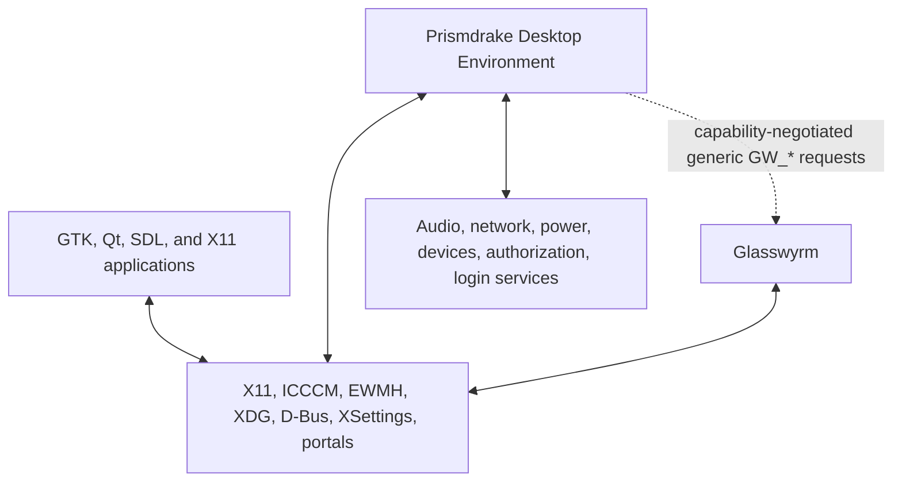
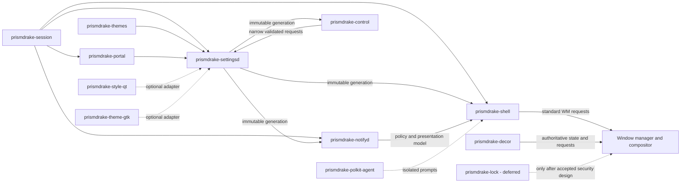

# Architecture overview

The Prismdrake architecture separates presentation, desktop policy, external
system authority, and optional native effects. Component boundaries remain
Proposed pending approval of [ADR 0002](../adr/0002-component-and-process-model.md).

## System context

## Proposed component model

Arrows express startup or data flow, not authority. The window manager and
compositor remain authoritative for window state, focus, stacking, workspaces,
composition, blur, capture, and output policy.

## Ownership summary

| Domain | Authority | Prismdrake behavior |
|---|---|---|
| Window state and policy | Glasswyrm or active WM | Mirror state and send standards/native requests |
| Composition and effects | Glasswyrm or active compositor | Request intent and geometry; select fallbacks |
| Desktop settings | `prismdrake-settingsd` | Validate and publish immutable generations |
| Shell presentation | `prismdrake-shell` | Render and interact without becoming state authority |
| Notification policy/history | `prismdrake-notifyd` | Route a presentation model to shell surfaces |
| Audio/network/power/devices | External system services | Present typed adapters and fail softly |
| Authorization | External authority plus isolated agent | Display minimal prompts; fail closed |
| Theme data | `prismdrake-themes` package, resolved by settings service | Consume validated token snapshots |

## Baseline and enhancement paths

The baseline uses XDG, D-Bus, XSettings, ICCCM, EWMH, freedesktop
notifications, StatusNotifierItem, portals, and ordinary alpha or opaque
materials. Optional Glasswyrm enhancements use separately accepted, versioned
`GW_*` capabilities. Missing enhancements never prevent core session startup;
blur falls back to a readable non-blur material and thumbnails fall back to
icons and titles.

Relevant requirements: `PD-SCOPE-001`, `PD-PLAT-001` through `PD-PLAT-004`,
`PD-COMP-001` through `PD-COMP-010`, and `PD-GW-001` through `PD-GW-010`.
